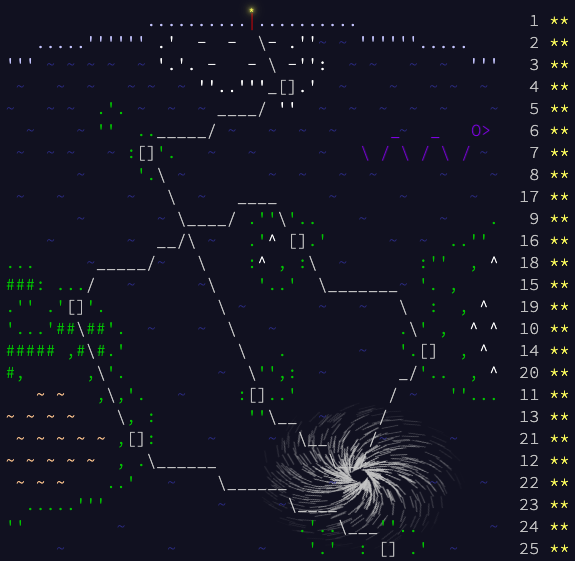

# Advent of Code solutions

These are me [Advent of Code](https://adventofcode.com/) (AoC) puzzle
solutions. My aim with this project is to learn and practice with new
programming languages.

## Advent of Code 2020

On [aoc2020](https://adventofcode.com/2020), I used Clojure 1.10 with Leiningen
2.9.3 on Java 1.8.0 OpenJDK 64-Bit.

**Language PROS.** Clojure makes it very straightforward to write data
pipelines, on-demand "lazy" processing and recursive functions. It has a
thorough standard library with an
[accessible documentation](https://clojuredocs.org/). Its out-of-the-box
immutable data structures are remarkably convenient and surprisingly efficient.

**Language CONS.** As a Lisp dialect, the syntax is unfamiliar to many other
popular languages, and the lack of syntactic sugar makes it particularly
verbose. The community is small, the stdlib is starting to lag feature support,
and there are no good vector or dataframes libraries. The startup is painfully
slow. Error messages are not helpful, so debugging is difficult.
Interoperability with Java and special forms could be more convenient.

**Implementation highlights.**
 * Integer 3-sum: [d01](./aoc2020/d01/main.clj).
 * Weighted digraph: [d07](./aoc2020/d07/main.clj).
 * State simulation [d08](./aoc2020/d08/main.clj),
 [d12](./aoc2020/d12/main.clj), [d14](./aoc2020/d14/main.clj),
 [d15](./aoc2020/d15/main.clj), [d22](./aoc2020/d22/main.clj) and
 [d23](./aoc2020/d23/main.clj).
 * Memoization: [d10](./aoc2020/d10/main.clj).
 * Cellular automata: [d11](./aoc2020/d11/main.clj),
 [d17](./aoc2020/d17/main.clj) and [d24](./aoc2020/d24/main.clj).
 * System of (modular) congruences: [d13](./aoc2020/d13/main.clj).
 * Solution searching: [d16](./aoc2020/d16/main.clj),
 [d19](./aoc2020/d19/main.clj) and [d20](./aoc2020/d20/main.clj).
 * Lexical parsing: [d18](./aoc2020/d18/main.clj).
 * Maximum bipartile matching: [d21](./aoc2020/d21/main.clj).
 * Pointers: [d23](./aoc2020/d23/main.clj).
 * Modular logarithm: [d25](./aoc2020/d25/main.clj).

## License

This repository is licensed under the
[MIT License](https://opensource.org/licenses/MIT). For more information,
please check out the accompanying [LICENSE.txt](./LICENSE.txt) file.
